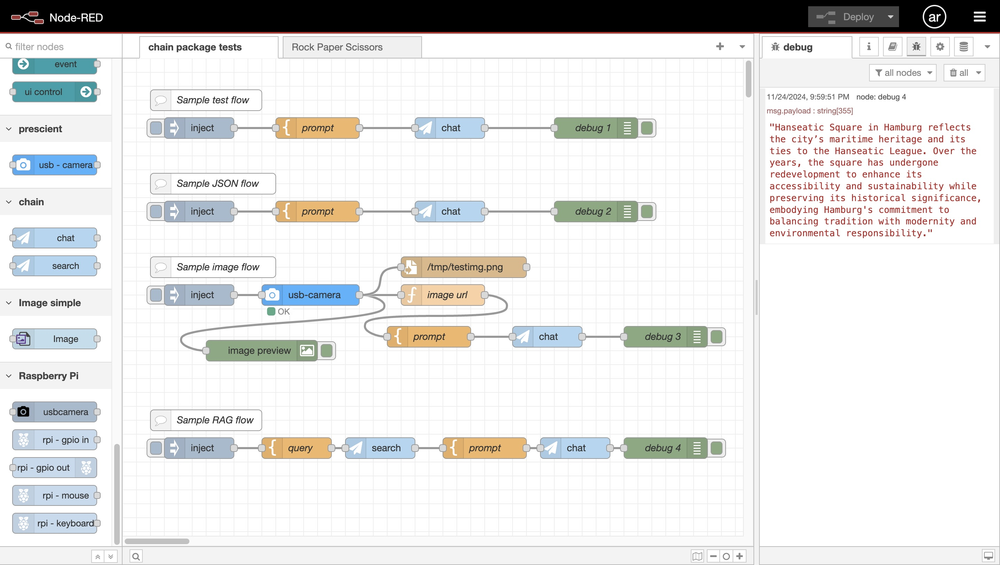

# Node-RED for Generative AI

Note: this is my hobby project.



## Background and Motivation

I need a node-based low-code development platform supporting LLM-chains with visual programming.

## Requirements

- Raspberry Pi
- [sqlite-vec](https://github.com/asg017/sqlite-vec)
- MQTT Broker (optional)

## Set up

### Running Node-RED on Raspberry Pi

https://nodered.org/docs/getting-started/raspberrypi

### sqlite-vec on Raspberry Pi with Node.js

=> [SQLITE_VEC.md](./SQLITE_VEC.md)

## My Original Node-RED package "chain"

=> [chain package](./chain)

### Installing the package

It is useful to define a bash alias for installing the package in Node-RED, like this:
```
alias rlc='cd ~/.node-red;npm install ~/node-red-genai/chain;node-red-stop;node-red-start'
```

## Flows

Node-RED flows => [flows](./flows)

## References

- https://nodered.org/docs/creating-nodes/
- https://randomnerdtutorials.com/how-to-install-mosquitto-broker-on-raspberry-pi/
 
