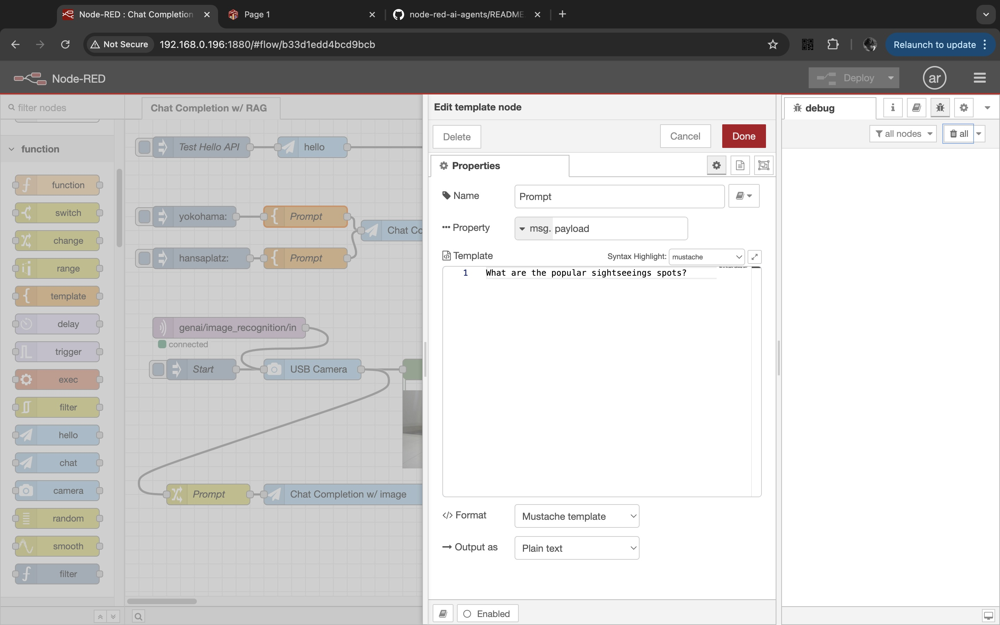
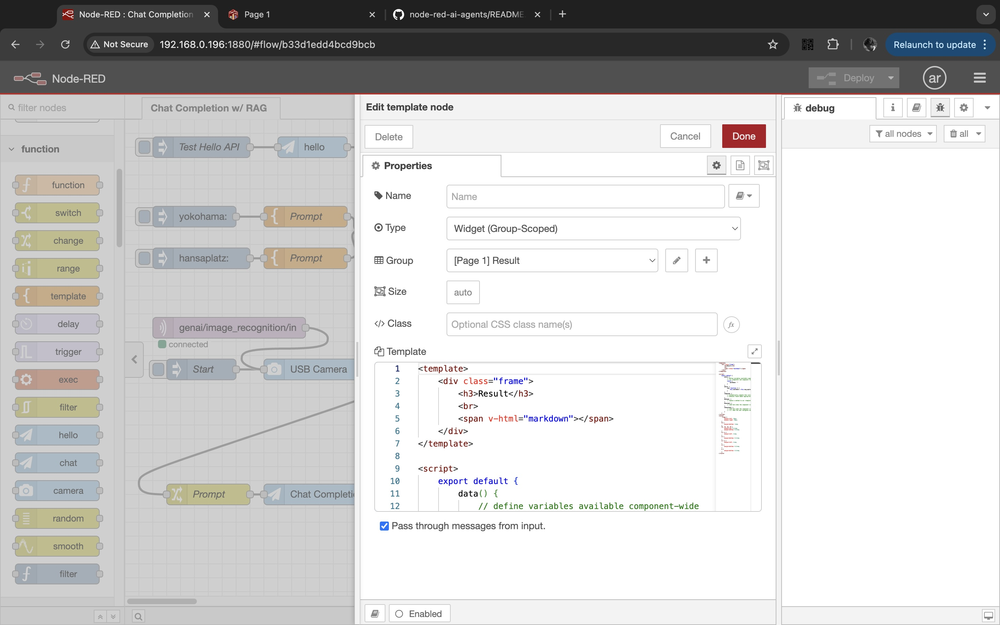
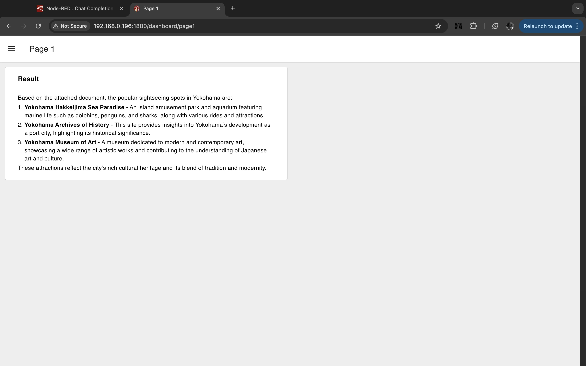
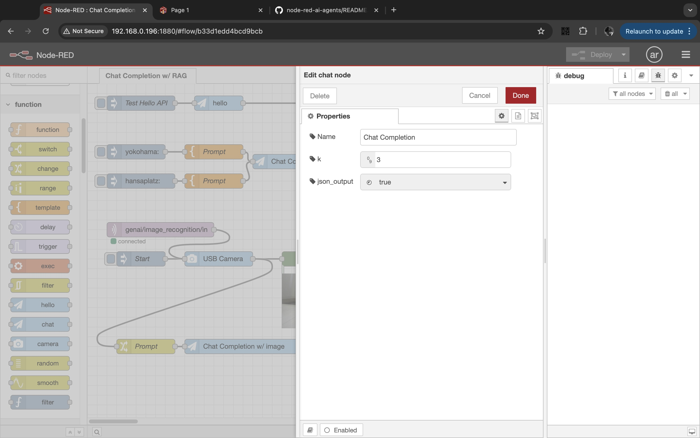
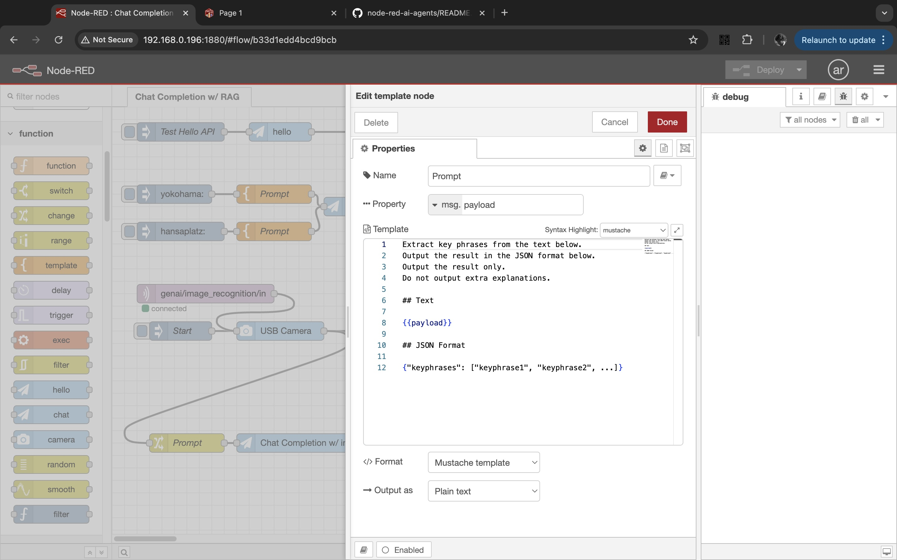

# Node-RED as an AI agent framwork

Note: 
- This is my hobby project.
- AI agent node not supported yet, to be developed soon.


## Background and Motivation

I am an engineer for my company's showroom. I need an AI agent framework that also supports IoT.

## Requirements

Everything in this project runs on Raspberry Pi:

- Raspberry Pi
- [Compact RAG (API Server)](https://github.com/araobp/compact-rag) and OpenAI API Key
- Mosquitto Broker (MQTT Broker)

## Set up

### Compact RAG (API Server)

This project uses my original API server: https://github.com/araobp/compact-rag

### Running Node-RED on Raspberry Pi

https://nodered.org/docs/getting-started/raspberrypi

### MQTT Broker setup

https://randomnerdtutorials.com/how-to-install-mosquitto-broker-on-raspberry-pi/

## Original Node-RED package "cx"

This project develops original Node-RED nodes as "cx package" to interwork with the Compact RAG for AI Agents.

=> [cx package](./cx)

### Installing the package

It is useful to define a bash alias for installing the package in Node-RED, like this:
```
alias rl='cd ~/.node-red;npm install ~/node-red-ai-agents/cx;node-red-stop;node-red-start'
```

## Samples

Sample Node-RED flows => [flows](./flows)

### Testing query with RAG






```
<template>
    <div class="frame">
        <h3>Result</h3>
        <br>
        <span v-html="markdown"></span>
    </div>
</template>

<script>
    export default {
        data() {
            // define variables available component-wide
            // (in <template> and component functions)
            return {
                markdown: ""
            }
        },
        watch: {
            msg: function () {
                this.markdown = this.msg.payload
            }       
        },
        computed: {
            // automatically compute this variable
            // whenever VueJS deems appropriate
        },
        methods: {
            // expose a method to our <template> and Vue Application
        },
        mounted() {
            // code here when the component is first loaded
        },
        unmounted() {
            // code here when the component is removed from the Dashboard
            // i.e. when the user navigates away from the page
        }
    }
</script>
<style>
    .frame {
        margin-left: 15px;
        margin-right: 15px;
    }
    h1 {
        margin-bottom: 1rem;
    }
    h2, h3, h4, h5 {
        margin-top: 0.1rem;
        margin-bottom: 0.3rem;
    }
    ul li {
        margin-left: 1rem;
    }
    ul {
        margin-bottom: 0.2rem;
    }
    ol li {
        margin-left: 1rem;
    }
    ol {
        margin-bottom: 0.2rem;
    }
    p {
        margin-bottom: 0.2rem;
    }
</style>
```



### Testing the camera






### Testing IoT flows

MQTT publisher (This script simulates a proximity sensor emitting an proximity event to the MQTT broker)

```
abc@raspberrypi:~/node-red-ai-agents/bin $ ./image_recognition_start.sh
```

MQTT subscriber (This script simulates a output device such as LCD)

```
abc@raspberrypi:~/node-red-ai-agents/bin $ ./image_recognition_result.sh 
{"keyphrases": ["indoor setting", "ceiling", "curtains", "windows", "wall clock", "square opening", "furniture", "lighting", "daytime", "ambient light"]}
```

## References

- https://nodered.org/docs/creating-nodes/
 
