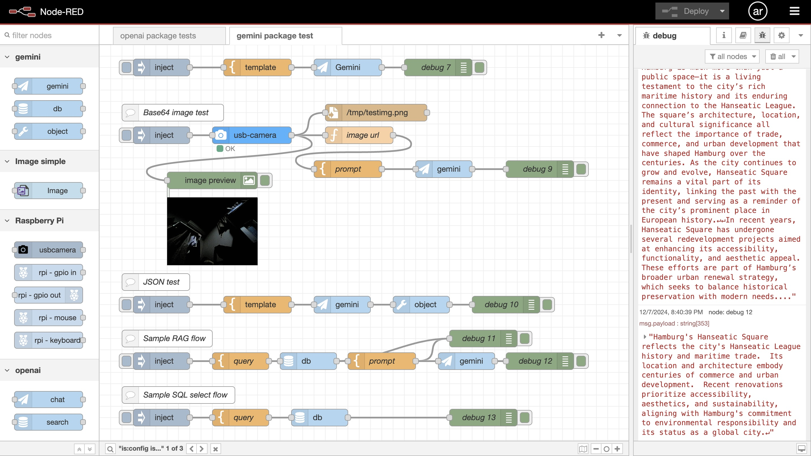

# Node-RED for Generative AI

Note: this is my hobby project.



## Background and Motivation

As a MVP developer for CX(Customer Experience) innovation, I need a node-based low-code development platform supporting LLM-chains with visual programming for agile GenAI app prototyping, to show how GenAI innovate CX.

## What is the LLM chain?

```
  in --> [Template] --> [LLM model] --> [Parser] ---> out
```

## Requirements

- [Node-RED](https://nodered.org/)
- [Gemini API](https://ai.google.dev/gemini-api/docs)
- [OpenAI API](https://platform.openai.com/docs)
- [sqlite-vec](https://github.com/asg017/sqlite-vec) (>= v0.1.6)

Note: You can start using Gemini API with the free tier.

## Set up

I use Raspberry Pi 3 (Linux) for this project, but all the programs in this project should run on other operating systems.

### Running Node-RED on Raspberry Pi

https://nodered.org/docs/getting-started/raspberrypi

### sqlite-vec on Raspberry Pi with Node.js

=> [SQLITE_VEC.md](./SQLITE_VEC.md)

## My Original Node-RED packages

- [gemini package](./gemini)
- [openai package](./openai)

### Installing the package

It is useful to define a bash alias for installing the package in Node-RED, like this:
```
alias rlg='cd ~/.node-red;npm install ~/node-red-genai/gemini;node-red-stop;node-red-start'
```
### RAG indexing

=> [indexing](./ref)

## Flows

Node-RED flows => [flows](./flows)

## Homework

=> [Winter Vacation Homework](WINTER_HOMEWORK.md)

## References

- https://nodered.org/docs/creating-nodes/
 
