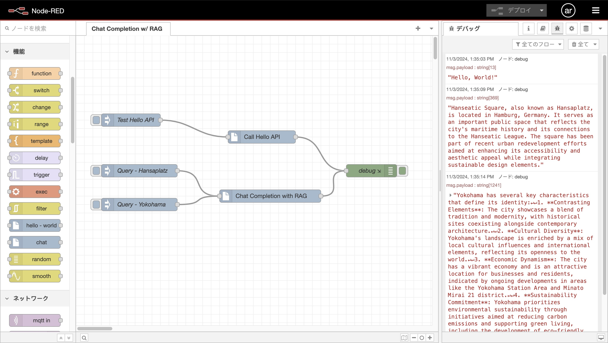

# Node-RED as an AI agent framwork

(Work in progress, this is my hobby project)



## Background and Motivation

I am an engineer for my company's showroom. I need an AI agent framework that also supports IoT.

## Requirements

Everything in this project runs on Raspberry Pi:

- Raspberry Pi
- [Compact RAG](https://github.com/araobp/compact-rag) and OpenAI API Key

## Set up

### API Server

This project uses my original API server: https://github.com/araobp/compact-rag

### Running Node-RED on Raspberry Pi

https://nodered.org/docs/getting-started/raspberrypi

## Original Node-RED package "cx"

This project develops original Node-RED nodes to interwork with the Compact RAG for AI Agents.

=> [cx package](./cx) (Work in progress)

### Installing the package

It is useful to define a bash alias for installing the package in Node-RED, like this:
```
alias rl='cd ~/.node-red;npm install ~/node-red-ai-agents/cx;node-red-stop;node-red-start'
```

## References

- https://nodered.org/docs/creating-nodes/
 
