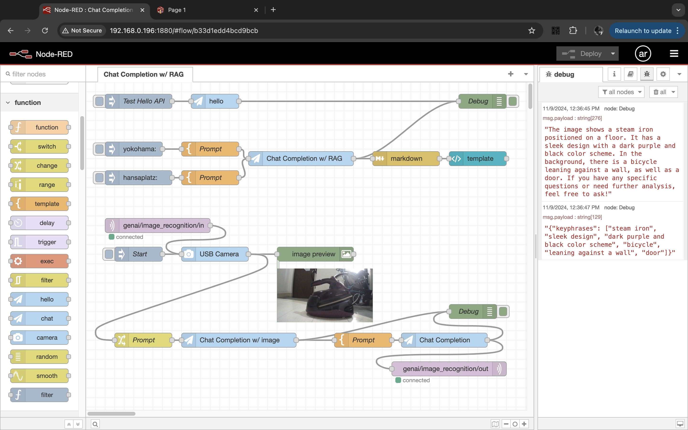

# Node-RED for Generative AI

Note: this is my hobby project.



## Background and Motivation

I am an engineer for my company's showroom. I need an AI agent framework that also supports IoT.

## Requirements

Everything in this project runs on Raspberry Pi:

- Raspberry Pi
- [Compact RAG (API Server)](https://github.com/araobp/compact-rag) and OpenAI API Key
- Mosquitto Broker (MQTT Broker)

## Set up

### Compact RAG (API Server)

This project uses my original API server: https://github.com/araobp/compact-rag

The reason why this project uses the API server made with Python: I want to use opencv, pandas and networks.

### Running Node-RED on Raspberry Pi

https://nodered.org/docs/getting-started/raspberrypi

### MQTT Broker setup

https://randomnerdtutorials.com/how-to-install-mosquitto-broker-on-raspberry-pi/

## Original Node-RED package "cx"

This project develops original Node-RED nodes as "cx package" to interwork with the Compact RAG for AI Agents.

=> [cx package](./cx)

### Installing the package

It is useful to define a bash alias for installing the package in Node-RED, like this:
```
alias rl='cd ~/.node-red;npm install ~/node-red-ai-agents/cx;node-red-stop;node-red-start'
```

## Flows

Node-RED flows => [flows](./flows)

- [SAMPLE_FLOWS.md](./docs/SAMPLE_FLOWS.md)
- [ROCK_PAPER_SCISSORS.md](./docs/ROCK_PAPER_SCISSORS.md)

## References

- https://nodered.org/docs/creating-nodes/
 
